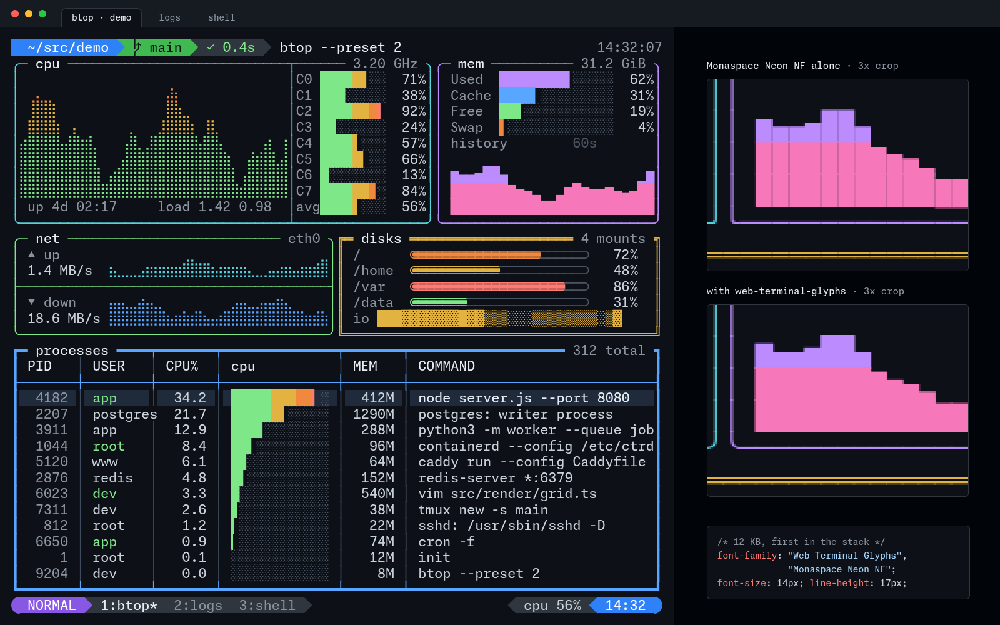

# web-terminal-glyphs

[](LICENSE)

web-terminal-glyphs is a 12 KB web font that makes box drawing, block elements, shades and braille tile with no gaps in a browser terminal. It sits in front of Monaspace Neon NF in the terminal's font stack and draws only the glyphs that must join their neighbours. Anyone can use it, under the Apache-2.0 license.



## What it does

web-terminal-glyphs gives a text-rendered browser terminal the unbroken lines and solid blocks a native terminal paints itself:

- Box-drawing lines, blocks, shades and braille meet the next row and column with no seam.
- Text selection and copy keep working, because every cell stays text.
- Letters, digits and spaces still come from Monaspace Neon NF, with its own metrics and look.
- One file covers 1,073 codepoints in Box Drawing, Block Elements, Braille, Powerline and the Legacy Computing blocks.

## Who it is for

web-terminal-glyphs is built for a DOM-rendered browser terminal, one whose cells are real text rather than a canvas. It expects Monaspace Neon NF at a 14px font on a 17px row. It is tested in Chromium, Firefox and WebKit at device pixel ratio 1 and 2. [web-terminal-ui](https://github.com/cplieger/web-terminal-ui) uses it in that setup. You need to serve Monaspace Neon NF as a web font beside it, in each weight and style your terminal uses, from a stylesheet you control.

The glyphs are drawn for that cell only, so the release has no OTF or TTF for desktop use. A native terminal's cell is whatever its own font size and line height produce, so an installed font would be subtly wrong at nearly every setting.

Consider the canvas or WebGL renderer of [xterm.js](https://xtermjs.org/docs/api/terminal/interfaces/iterminaloptions/) if your terminal can draw its cells on a canvas. Its `customGlyphs` option, on by default, draws box drawing and block elements itself, so lines stay continuous even with a custom line height.

## Install

The font is published as four release assets. Fetch them and serve them beside your text face:

```text
https://github.com/cplieger/web-terminal-glyphs/releases/latest/download/WebTerminalGlyphs.woff2
https://github.com/cplieger/web-terminal-glyphs/releases/latest/download/cell.json
https://github.com/cplieger/web-terminal-glyphs/releases/latest/download/LICENSE
https://github.com/cplieger/web-terminal-glyphs/releases/latest/download/NOTICE
```

In an image build, pin a release tag and a SHA-256 rather than `latest`. The asset bytes never change under a tag.

## Usage

Declare the font once for each weight and style you use, all pointing at the same file. Then put the family first in the font stack of the element that renders cells:

```css
@font-face {
  font-family: "Web Terminal Glyphs";
  src: url("/vendor/fonts/WebTerminalGlyphs.woff2") format("woff2");
  font-weight: 400;
  font-style: normal;
  font-display: block;
}
/* repeat for 700/normal, 400/italic, 700/italic with the same src */

.term {
  font-family: "Web Terminal Glyphs", "Monaspace Neon NF", monospace;
  font-size: 14px;
  line-height: 17px;
  font-synthesis: none;
}
```

The four exact declarations keep every browser from synthesising a bold or an oblique of the one upright design. Box drawing must never slant or thicken.

## The cell contract

The glyphs are drawn for one cell and are wrong for any other. `cell.json` ships beside the font and states that cell. Sizes are in font units, 2000 to the em.

| Field | Value | Meaning |
| --- | --- | --- |
| `companion.family` | `Monaspace Neon NF` | the text face the glyphs are paired with |
| `companion.advance` | 1240 / 2000 em | the advance every glyph here shares, so no cell is padded |
| `companion.ascender`, `descender`, `lineGap` | 1890 / -400 / 200 | copied from the companion, because Firefox sizes each row from the first font in the stack |
| `cell.fontSize`, `cell.lineHeight` | 14 / 17 | the only ratio the glyphs tile at |
| `cell.overhang` | 72 units | how far a solid glyph reaches past a cell edge, so neighbouring cells leave no seam |
| `stack` | this font, then the companion | the `font-family` order the glyphs expect |
| `generated` | 1,073 codepoints | the ranges this font answers for |
| `rule` | a sentence | what this font draws, and what it leaves to the companion |

Gate on it at build time. Compare `cell.json` against the CSS you ship and against the companion file you vendor. A companion release that changes its advance or metrics, or a stylesheet that changes the cell, then fails the build instead of showing up as a visual bug on a phone.

## What is generated

The set follows the glyphs [kitty](https://github.com/kovidgoyal/kitty) draws itself. Beyond the blocks named above, it covers Fira Code's progress glyphs, kitty's branch-drawing glyphs and four Geometric Shapes triangles. Every glyph comes from a table entry, so a new range is a table change and a rebuild.

This font draws only what Monaspace Neon NF cannot tile at the declared cell. The glyph tables cover 1,098 codepoints, and Monaspace lacks 901 of them, so this font draws those. Monaspace has the other 197. It keeps 25 that already tile or are text symbols, and this font draws the remaining 172. Most of Monaspace's lines and blocks do not reach far enough past the cell edge to cover the boundary pixel. [How it works](docs/how-it-works.md) lists the ranges, the measurements and the rules each glyph follows.

## Building

```sh
uv run scripts/build.py          # dist/WebTerminalGlyphs.woff2, cell.json, LICENSE, NOTICE
uv run pytest tests/geometry     # invariants on the built font
uv run pytest tests/render       # Chromium, Firefox and WebKit through Playwright
```

The build needs Python 3.14 or newer. The glyph table derives the Legacy Computing Supplement entries from `unicodedata` names, and those exist from Unicode 16.0, the database Python 3.14 ships. Python 3.13 carries Unicode 15.1.

The render tests need `uv run playwright install chromium firefox webkit` once. On a fresh Ubuntu machine, Firefox and WebKit also need `--with-deps`. The tests run each engine at device pixel ratio 1 and 2 and page zoom 1.0 and 1.1.

They also need the companion face to pair against. Set `MONASPACE_DIR` to a folder holding the four `MonaspaceNeonNF-{Regular,Bold,Italic,BoldItalic}.woff2` files from a [Monaspace release](https://github.com/githubnext/monaspace/releases). `bash scripts/fetch-companion.sh <dir>` downloads them and checks their pinned SHA-256 digests. The test session copies them into `tests/fixtures/base/` at start and deletes the copy at exit. The repository never commits Monaspace, and the build never reads it.

The cell and the companion's measurements are constants in `glyphs/cell.py` and `glyphs/companion.py`. To use another text face or cell size, fork the repository and change them.

## Related projects

- [web-terminal-engine](https://github.com/cplieger/web-terminal-engine) is the terminal emulator and browser renderer whose cells these glyphs are drawn for.
- [web-terminal-ui](https://github.com/cplieger/web-terminal-ui) is the browser UI that declares the cell and ships the stylesheet this font pairs with.

## Credits

- The generated set follows the glyphs [kitty](https://github.com/kovidgoyal/kitty) draws itself, and the branch lines and commit markers follow kitty's designs.
- [Monaspace](https://github.com/githubnext/monaspace) Neon NF is the companion text face the glyphs are measured against and paired with. It is used unmodified.

## Documentation

- [How it works](docs/how-it-works.md) lists the codepoint ranges, the measurements against Monaspace and the geometry rules, for anyone changing the glyphs.

## Contributing

Issues and pull requests are welcome. See [CONTRIBUTING.md](CONTRIBUTING.md).

## Disclaimer

This project is built with care and follows security best practices, but it is intended for personal / self-hosted use. No guarantees of fitness for production environments. Use at your own risk.

This project was built with AI-assisted tooling using [Claude](https://claude.com), [GPT](https://openai.com), and [Kiro](https://kiro.dev). The human maintainer defines architecture, supervises implementation, and makes all final decisions.

## License

Apache-2.0, the font file included. See [LICENSE](LICENSE). The glyph outlines are generated from this repository's own geometry tables; nothing of the companion face is copied into the font. Monaspace is consumed unmodified under its own [SIL Open Font License 1.1](https://github.com/githubnext/monaspace/blob/main/LICENSE).
